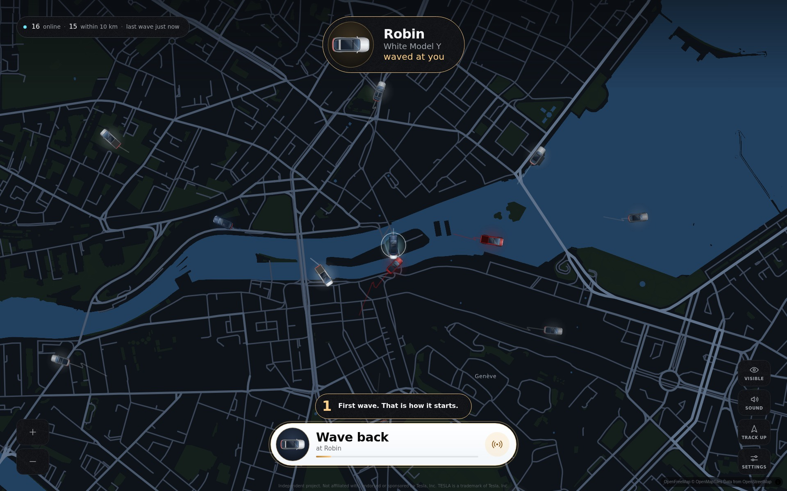
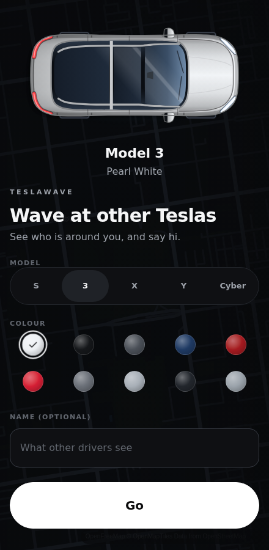
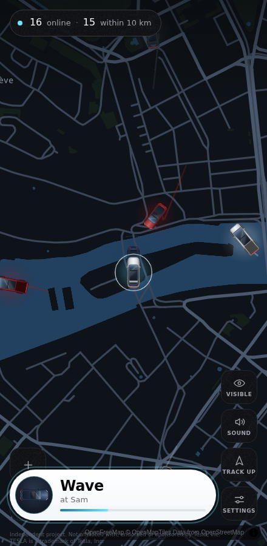

<div align="center">

# TeslaWave

**See the Teslas around you on a live map, and wave at them.**

Free, no account, nothing to install. Built to run in the Tesla in-car browser while
driving, and on a phone in a dash mount.

[](https://github.com/Meg4mi/teslawave/actions/workflows/ci.yml)
[](https://github.com/Meg4mi/teslawave/actions/workflows/e2e.yml)
[](https://github.com/Meg4mi/teslawave/actions/workflows/deploy.yml)
[](LICENSE)

**[teslawave.app](https://teslawave.app)**
· [How it fits together](#how-it-fits-together)
· [The protocol](docs/protocol.md)
· [Privacy](docs/privacy.md)
· [Decisions](docs/decisions)
· [Contributing](CONTRIBUTING.md)



</div>

> Independent project. Not affiliated with, endorsed or sponsored by Tesla, Inc.
> TESLA is a trademark of Tesla, Inc.

A driver opens one page. Their car appears on the map, the cars around them appear beside it,
and when one comes within 300 m a button rises: wave. The other screen says who waved, and
offers to wave back. That is the whole product.

Positions are never written to a database. Only wave counters are, and only when they change.

<table>
<tr>
<td width="50%" valign="top">

<p align="center"><sub><b>Pick a car and go.</b> No sign-up, no permissions beyond the position the browser already offers.</sub></p>
</td>
<td width="50%" valign="top">

<p align="center"><sub><b>A phone in a dash mount</b> is the same build as the car screen, at a quarter of the width.</sub></p>
</td>
</tr>
</table>

<sub>All three pictures are generated by `pnpm gen:screens`: the real client, the real hub and
the real protocol over a real socket, with only the GPS simulated (see
[ADR-0038](docs/decisions/0038-the-demo-is-generated.md)).</sub>

## How it fits together

|                     |                                                                         |
| ------------------- | ----------------------------------------------------------------------- |
| `packages/protocol` | wire types, geohash cells, interpolation, send rates                    |
| `packages/hub-core` | presence, per-cell diffs, waves, rate limits, counters (pure functions) |
| `apps/worker`       | Cloudflare Worker + HubDO (WebSocket hibernation) + D1 + static assets  |
| `apps/web`          | Vite + React 19 SPA: MapLibre map, canvas car overlay, the wave         |

A driver's client sends its position as the device reports it, works out which geohash cells it is in,
and opens one WebSocket to the Durable Object that owns that region. The hub keeps presence
in memory, broadcasts a diff per cell at most every two seconds, and forgets anyone who
stops reporting for a minute. The client interpolates and dead-reckons between updates so
cars glide at 60 fps instead of jumping every two seconds.

The `hello` carries `PROTOCOL_VERSION`. A hub that speaks a newer one answers with `upgrade`,
and the client reloads itself the next time the car is standing still — never while moving,
and at most once per version per tab. A Tesla is pinned to a tab for weeks, so this is the
only way a build in the field can ever be replaced ([ADR-0029](docs/decisions/0029-protocol-version-and-remote-reload.md)).
Bump the version when a change would make an old client and a new hub disagree.

A driver is sent the cars within 12 km of them, not every car in the cell, and each one is
described once and then referred to by a small handle: six numbers a tick instead of 210
bytes. That is what makes a dense city possible — the old wire put 75 kB on every socket every
two seconds at 500 drivers, which an Intel Atom cannot parse ([ADR-0033](docs/decisions/0033-interest-and-the-compact-wire.md)).
Both wires are spoken at once, so a client that has not reloaded yet keeps working. `pnpm bench`
prints the table the socket caps are set from; re-run it after touching `flushIfDue`.

Before joining, `/api/pulse` says how many drivers are around and `/api/activity` tints the
map cells that have seen waves this week. Both are counts from data the app already stores,
both are cached per cell rather than per visitor, and neither can say anything about a person
([ADR-0032](docs/decisions/0032-an-empty-map-is-the-product-risk.md)).

The whole wire, message by message, is in [docs/protocol.md](docs/protocol.md).

## Running it

```bash
pnpm install
pnpm --filter @teslawave/worker db:local   # apply D1 migrations locally, once
pnpm build                                 # the worker serves apps/web/dist
pnpm dev:worker                            # http://127.0.0.1:8787
```

For UI work with hot reload, `pnpm dev` runs Vite on :5173 and proxies `/api` to the worker.

An empty map is a bad way to build a social product, so there is a fleet of simulated drivers:

```bash
pnpm sim -- --n 20 --center 46.2044,6.1432 --radius 5000
```

Every bug found on a real car screen so far has been an ordering bug _between_ the hub and
the client, invisible from inside either half. `apps/web/src/sim/roundtrip.test.ts` runs the
real hub against the real client on a virtual clock — drops, hibernation wakes, cell
crossings — and checks its invariants after every message rather than once per tick, because
two diffs that are correct together still blink if a frame is drawn between them. A protocol
change gets proved there first ([ADR-0031](docs/decisions/0031-the-two-halves-are-tested-against-each-other.md)).

`/kitchen-sink` (development only) renders every signature moment on demand: the boot sonar,
a wave sent, received and returned, the milestone card, and the whole sprite matrix.
`/art?colour=deepblue` renders every model large, in one paint, beside its map-sized sprite:
the cars are one drawing (`overlay/model-art.ts`) rendered as SVG in the UI and baked to a
bitmap for the map, and this is where a change to the drawing gets judged.
`pnpm art out.png all` (in `apps/web`) screenshots the same sheet in every colour without a
browser open, which is how a pass on the drawings is checked before it is committed.

## Checks

```bash
pnpm lint        # includes the cost invariants, see below
pnpm typecheck
pnpm test        # protocol, hub-core, worker (real WebSockets), web
pnpm test:e2e    # Playwright: car screen at both densities, and a phone
pnpm check:css   # no blur, no animated shadows, no hardcoded screen size
pnpm check:size  # under 400 kB gzipped, excluding MapLibre
pnpm bench       # what one broadcast tick costs, on both wires, at several densities
```

Against a deployed URL, the same suite runs without a local server:

```bash
E2E_BASE_URL=https://teslawave.meg4mi.workers.dev pnpm test:e2e
SMOKE_URL=https://teslawave.meg4mi.workers.dev node scripts/smoke.mjs
```

Every push and pull request runs the fast checks ([`ci.yml`](.github/workflows/ci.yml)). The
Playwright suite is not part of that: it is slow and needs a Chromium download, so it has its
own workflow ([`e2e.yml`](.github/workflows/e2e.yml)) that runs every night, on any pull
request touching the rendering path (`apps/web/src/{map,overlay,screens,ui,app}`, the CSS, the
specs), and on demand from the Actions tab or with `gh workflow run e2e.yml`.

<details>
<summary>Two things about the suites that are easy to trip over</summary>

<br>

The browser security policy lives in `apps/web/public/_headers`, not in the Worker: assets are
served by the asset layer to keep them outside the request quota, so the Worker never sees them
([ADR-0030](docs/decisions/0030-security-headers-at-the-asset-layer.md)). It is enforced by the
browser and by nothing else, which is why `e2e/csp.spec.ts` drives the real app behind the real
header and fails on the browser's own violation events. Changing that file without running the
e2e suite is changing it blind.

The end-to-end suite runs the real worker under `wrangler dev`, supervised
(`apps/worker/scripts/dev-supervised.mjs`): wrangler's dev proxy can exit when a client drops
a WebSocket abruptly, which the suite does on purpose, and without the supervisor every test
after that point failed with a refused connection.

</details>

## The cost invariants

The whole thing is meant to run on Cloudflare's free plan, where exceeding a limit causes an
error rather than a bill. That only holds while the hub stays eligible for hibernation. These
rules are enforced by ESLint on `apps/worker/src/**` and by tests, and they are not style:

1. No `setTimeout`, `setInterval` or alarms in the hub. The broadcast tick is driven by
   arriving messages.
2. Sockets are accepted with `ctx.acceptWebSocket()`, never `ws.accept()`.
3. No `fetch` and no D1 from a message handler.
4. Positions are never persisted; counter writes are debounced and limited to changed keys.
5. The hub id is validated at the edge, so at most 1,024 Durable Objects can ever exist.

Breaking (1) or (2) means every object with a connected driver is billed around the clock:
roughly $800 a month for a couple of hundred objects, and about $4,000 for one per user.
Rule (5) is what bounds that damage. `scripts/usage-report.mjs` checks yesterday's real
numbers against the free-tier limits every morning and shouts if duration looks like an
object that never went to sleep.

The numbers, the traffic model and the rejected alternatives are in
[ADR-0002](docs/decisions/0002-hub-durable-object-and-cost-model.md).

## What a link looks like

The landing page and the app are one route, so `apps/web/index.html` carries a real shell —
tagline, description, how it works, the privacy link — that paints before the bundle and is
replaced when the app mounts; it is what a crawler, a link unfurler and a driver on LTE see
first ([ADR-0034](docs/decisions/0034-the-shell-is-the-landing-page.md)). The title,
description, Open Graph tags, JSON-LD, `robots.txt`, `sitemap.xml` and the web manifest are
all written from `packages/protocol/src/brand.json` by the Vite config, so the brand stays a
one-file change.

<div align="center">

</div>

<details>
<summary>The card, the icons, the screenshots and the demo clip are all generated</summary>

<br>

The image a shared link unfurls into is the share card with the product's words on it, drawn
by the app at `/og` (development only) and screenshotted:

```bash
pnpm gen:social        # writes public/og.png and the PNG icons; CHROMIUM_PATH=... if needed
pnpm gen:screens       # writes the README pictures to docs/images/ (worker running on :8787)
```

Re-run them when the card drawing, the tagline, the icon or the app's own screens change, and
commit the result.

The demo clip is generated the same way, by the app crossing itself:

```bash
pnpm gen:demo          # two phones side by side -> public/demo/demo.mp4
pnpm gen:demo -- --car # the 1920x1200 car screen instead
```

It builds the bundle and starts the worker itself, unless one is already answering on :8787,
and stops the one it started; `DEMO_BASE_URL` points it at a server you are keeping alive.

Two browser contexts, the real client, the real hub, the real protocol over a real socket:
only the GPS is simulated. It exists because a filmed clip needs two drivers who both have
this and who cross paths, which is the thing the app does not have yet — and because the car
drawings changed in five of the last sixteen commits, and nobody re-shoots a road for a
sprite change ([ADR-0038](docs/decisions/0038-the-demo-is-generated.md)). It needs a machine
that can reach the tile host, and says so when it cannot. It is a screen recording, and every
post that carries it should say so.

</details>

Where and how to put the link in front of drivers is in [docs/distribution.md](docs/distribution.md),
and the copy to paste when you get there is in [docs/outreach](docs/outreach/README.md).

## Deploying

```bash
wrangler login
wrangler d1 create teslawave          # put the id in apps/worker/wrangler.jsonc
pnpm --filter @teslawave/worker db:remote
pnpm deploy                           # -> teslawave.<account>.workers.dev
```

[`deploy.yml`](.github/workflows/deploy.yml) does the same from GitHub Actions, so no token
ever leaves GitHub: it runs the full check suite, makes sure the D1 database exists, applies
migrations, deploys, and then smoke-tests the live URL — including opening a real WebSocket to
a real Durable Object, because a green deploy is not evidence that anything works. It deploys
on a push to `main`, on a manual run, or on any commit whose message contains `[deploy]` —
that last one exists to bootstrap the first deploy, since `workflow_dispatch` only appears
once the workflow is on the default branch.

<details>
<summary>What to set in the repository settings, once</summary>

<br>

| Where                                           | Name                    | Value                                                     |
| ----------------------------------------------- | ----------------------- | --------------------------------------------------------- |
| Secrets and variables → Actions → **Secrets**   | `CLOUDFLARE_API_TOKEN`  | a token with the four permissions below                   |
| Secrets and variables → Actions → **Variables** | `CLOUDFLARE_ACCOUNT_ID` | your account id (an identifier, not a secret)             |
| Variables, optional                             | `DEPLOY_URL`            | set once the custom domain is live, so smoke tests hit it |
| Secrets, optional                               | `CF_ANALYTICS_TOKEN`    | read-only token for the daily usage report                |
| Variables, optional                             | `VITE_CF_BEACON_TOKEN`  | Web Analytics beacon; baked into the HTML by the deploy   |

</details>

<details>
<summary>Deploying from a terminal, and the four permissions a token needs</summary>

<br>

Use a scoped API token instead of `wrangler login`:

```bash
export CLOUDFLARE_ACCOUNT_ID=...     # Workers & Pages -> Overview
export CLOUDFLARE_API_TOKEN=...      # never committed, never written to a file
```

The token needs four account-scoped permissions: **Workers Scripts: Edit** (the Worker, the
Durable Object namespace, static assets and the cron), **D1: Edit** (create the database and
run migrations), **Account Settings: Read**, and **Account Analytics: Read** if you also want
`pnpm usage`. No KV and no R2.

It also needs two zone-scoped ones — **Zone → Workers Routes: Edit** and **Zone → DNS: Edit**
— because `apps/worker/wrangler.jsonc` declares `teslawave.app` as a custom domain. That is
deliberate: the address is printed on the share card, in the Open Graph tags and in every
outreach post, so a deploy from a clean checkout has to reproduce it rather than depend on
somebody having wired it in the dashboard once. A token without those two fails at the deploy
step instead of quietly publishing to workers.dev only. A fork that does not own the domain
removes the `routes` entry.

`workers.dev` stays enabled alongside it — but only because `"workers_dev": true` says so
explicitly. Adding `routes` turns it off by default and takes preview URLs with it, which is
worth knowing before wondering where the workers.dev address went. Set the `DEPLOY_URL`
variable to point the smoke test at the custom domain; the workers.dev URL parsed out of the
deploy log is only the fallback when it is unset.

**Cloudflare Web Analytics** is turned on by `VITE_CF_BEACON_TOKEN`, and it is a build-time
value rather than a runtime one: the beacon tag is written into `index.html` while the bundle
is built, so it has to be present for `pnpm build` and setting it anywhere else does nothing.
In CI that is the repository variable in the table above, which `deploy.yml` passes to the
build step. It is a **variable and not a secret** on purpose — the token is served to every
visitor inside the HTML, so it is public by construction, and masking it in the logs would
only make a missing one harder to spot. From a terminal:

```bash
VITE_CF_BEACON_TOKEN=... pnpm build     # the token is on the Web Analytics site in the dashboard
```

Unset means no beacon and no script at all, which is what previews, forks and development
should get. A token that is set but is not 8-64 hex characters is a build with no beacon in
it, so the build says so rather than leaving an empty dashboard to be discovered a week
later.

</details>

Two things worth doing on the first deploy, in this order:

1. Open it on a real Tesla and fill in a row of [docs/tesla-notes.md](docs/tesla-notes.md).
   CI has no GPU, so that and the performance beacon are the only real performance data
   that exist. Turn on "Share performance data" in Settings on the car, and `pnpm perf`
   prints what real screens report ([ADR-0027](docs/decisions/0027-performance-beacon.md)).
2. After 24 hours of traffic, run `pnpm usage`. Durable Object duration should be in the low
   hundreds of GB-s. If it is near 10,800, the hub is not hibernating: stop and find the
   timer, the `ws.accept()`, the alarm or the in-flight `fetch` before anything else.

`WS_ENABLED=false` in the dashboard is a kill switch that needs no deploy. Preview URLs come
from Workers Builds on non-production branches, or `wrangler versions upload`.

## Documents

- [docs/decisions](docs/decisions) — one file per non-obvious decision, written as it was made
- [docs/protocol.md](docs/protocol.md) — the wire between the car and the hub, end to end: every message, every rule, and the numbers behind them
- [docs/privacy.md](docs/privacy.md) — what leaves the car, what is kept, and for how long
- `/privacy` and `/terms` — the same two promises inside the app, in every language, from
  the catalogue rather than from a file a driver would never find ([ADR-0037](docs/decisions/0037-terms-safety-and-a-controller.md))
- [docs/distribution.md](docs/distribution.md) — where drivers are, and the order to reach them in
- [docs/outreach](docs/outreach/README.md) — the copy to paste in each of those places, in both languages, and what may not be claimed
- [docs/tesla-notes.md](docs/tesla-notes.md) — findings from real cars, the only real data
- [docs/design-qa.md](docs/design-qa.md) — the checklist a release walks before it ships
- [CONTRIBUTING.md](CONTRIBUTING.md) — the checks, the cost invariants, and how a protocol change gets proved
- [SECURITY.md](.github/SECURITY.md) — what to report privately, and where

## Contributing

The product only works when two people who have it cross paths, so the most valuable thing
anybody can do is drive with it and say what happened: a row in
[docs/tesla-notes.md](docs/tesla-notes.md) from a real car is worth more than most patches.
There is a [car report](https://github.com/Meg4mi/teslawave/issues/new?template=car_report.yml)
issue form for exactly that.

Everything else — the checks to run, the five rules that are not style, how a protocol change
gets proved, and where the copy lives — is in [CONTRIBUTING.md](CONTRIBUTING.md).

## Licence

[Apache License 2.0](LICENSE). Fork it, run it, take pieces of it.

Section 6 withholds trademark rights deliberately: the code is yours to reuse, the TeslaWave
name is not. That matters more than usual here, because the name already borrows somebody
else's mark and the disclaimer only holds while this stays an independent project.

There is no CLA. Under section 5, what you submit is contributed under the same licence and
the copyright in it stays yours. [CONTRIBUTING.md](CONTRIBUTING.md) has the rest.

Map data comes from OpenStreetMap contributors, served by
[OpenFreeMap](https://openfreemap.org); its attribution is displayed on the map and is not
optional ([ADR-0006](docs/decisions/0006-map-style.md)).
