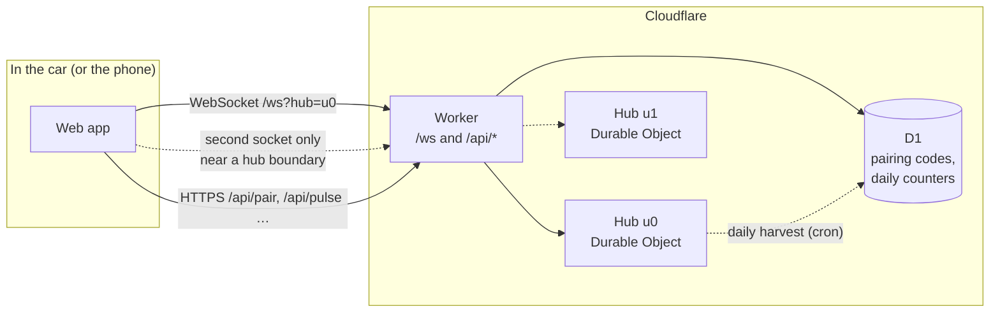
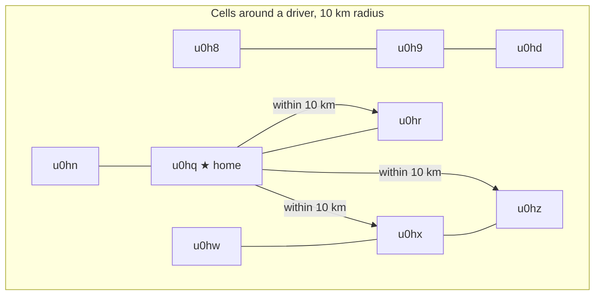
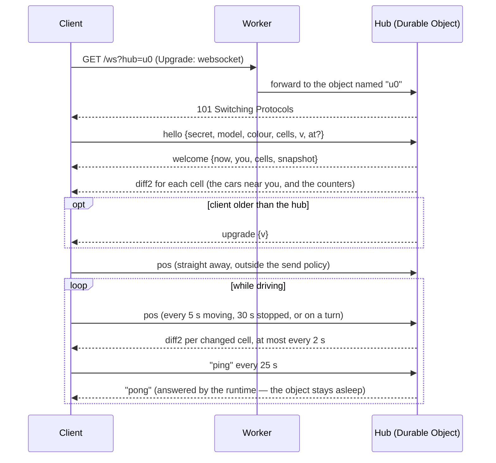
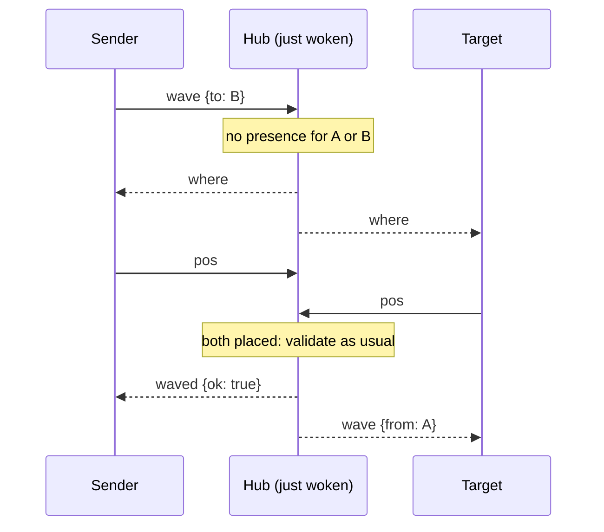

# The TeslaWave protocol

How a car on the road becomes a car on somebody else's screen, and how a tap on one screen
becomes a chime on another. This is the wire between the browser and the hub, described end
to end: the geography it is sharded on, the life of a connection, every message in both
directions, the rules the hub enforces, and the reasoning behind the numbers.

Everything here is implemented in three places, and the document follows them:

| Where                                  | What                                                                                                             |
| -------------------------------------- | ---------------------------------------------------------------------------------------------------------------- |
| `packages/protocol`                    | The types, the guards, the constants, and the maths. Shared by both halves, so neither can drift from the other. |
| `packages/hub-core`                    | The hub: a pure module with no timers, no I/O and no Cloudflare in it. It turns messages into effects.           |
| `apps/worker`                          | The Durable Object that hosts the hub, and the small HTTP API around it.                                         |
| `apps/web/src/net`, `apps/web/src/sim` | The client's side: sockets, send policy, and the world model that turns diffs into motion.                       |

The decision records in `docs/decisions` say _why_ each part is the way it is; this document
says _what_ it does. Where a number comes from a decision, the record is named.

---

## 1. The shape of the system



- **One Durable Object per hub.** A hub is a geohash prefix of two characters, about
  1,250 × 625 km. At most 1,024 hubs can ever exist, which bounds the worst-case bill
  (ADR-0002). All of Western Europe's launch geography is hub `u0`.
- **Inside a hub, everything is per cell.** A cell is a geohash of four characters, about
  39 × 19.5 km at the equator. Subscriptions, diffs, counts and caps are all per cell.
- **The hub is message-driven.** There is no timer anywhere in it: the broadcast tick runs
  when a message arrives, and an idle hub hibernates and costs nothing. Positions live only in
  its memory and are never written anywhere. What survives hibernation is each socket's
  small profile and the wave counters.
- **The client holds one socket per hub** it needs, usually one, up to three at a corner.

---

## 2. Geography: cells, hubs and the subscription set

The world is tiled with geohashes. A geohash is a string over the alphabet
`0123456789bcdefghjkmnpqrstuvwxyz`; each extra character divides the box 32 ways.

| Name | Precision    | Size (equator)  | Used for                                                           |
| ---- | ------------ | --------------- | ------------------------------------------------------------------ |
| Hub  | 2 characters | ~1,250 × 625 km | Which Durable Object owns a cell: `hubOf(cell) = cell.slice(0, 2)` |
| Cell | 4 characters | ~39 × 19.5 km   | Subscription, fan-out, counts, capacity                            |

A driver at `(lat, lng)` computes their subscription set with `cellsWithin`:

1. The **home cell** the position is in.
2. Every one of its eight **neighbours whose box lies within 10 km** (`NEIGHBOUR_RADIUS_M`)
   of the position, nearest first.
3. Capped at **4 cells** (`MAX_CELLS_PER_CLIENT`): home plus up to three neighbours, which is
   what a corner gives.

The cells are grouped by hub (`groupByHub`), and the client opens one socket per hub, at most
three (`MAX_SOCKETS_PER_CLIENT`). Nearly always the whole set is on one hub. Near a hub
boundary a driver reports to two hubs, so both hold the car, and the rules in §8 decide which
one of them accepts a wave.



The driver above subscribes to `u0hq` (home) and the three neighbours whose boxes come within
10 km, all on hub `u0`: one socket.

Why cells this large: a cell is a _routing_ unit, not a _visibility_ unit. What a driver
actually sees is decided by the interest filter in §7.4, a circle of 12 km around them.

---

## 3. Identity

There is no account. Identity is a **secret** the browser generates once (`crypto.randomUUID`)
and keeps in `localStorage`. It is between 16 and 128 characters and looks like a UUID.

The secret is sent to the hub in `hello` and nowhere else. The hub derives the **public id**
everyone else sees:

```
id = sha256("teslawave-id:" + secret).slice(0, 32)
```

The prefix is a domain separator, so the same secret used anywhere else hashes to something
unrelated. The hash is one-way: an id read off the wire cannot be used to become that driver
(ADR-0025). The prefix must never change: it would rehash every driver into a stranger and
orphan their wave counts.

Two devices with the same secret are the same driver. That is what pairing does (§13): the
phone hands its secret to the car through a six-character code, and the hub gives both
sockets the same id.

What travels with an identity:

| Field       | Values                                                                                                    | Notes                                                                              |
| ----------- | --------------------------------------------------------------------------------------------------------- | ---------------------------------------------------------------------------------- |
| `model`     | `S`, `3`, `X`, `Y`, `CT`                                                                                  |                                                                                    |
| `colour`    | `pearl`, `black`, `midnight`, `deepblue`, `red`, `ultrared`, `stealth`, `quicksilver`, `diamond`, `steel` | The id is the wire format; the hex never leaves the client.                        |
| `nick`      | up to 16 characters                                                                                       | Optional. Trimmed, inner whitespace collapsed. Written the way its owner wrote it. |
| `spectator` | `true` or absent                                                                                          | A driver with no position: sees, is not seen, cannot wave.                         |

---

## 4. The life of a connection



### 4.1 Opening the socket

`GET /ws?hub=<id>` with the WebSocket upgrade headers. The Worker answers before the hub is
ever reached:

| Status | Meaning                                       | What the client does                                            |
| ------ | --------------------------------------------- | --------------------------------------------------------------- |
| `101`  | Upgraded                                      | Sends `hello`.                                                  |
| `400`  | The hub id is not two geohash characters      | Never happens from our own client.                              |
| `426`  | No `Upgrade` header                           | Used on purpose as a cheap probe: "is the service up?"          |
| `429`  | The day's free Durable Object budget is spent | Shows "back at midnight"; stops retrying until then (`budget`). |
| `503`  | The kill switch (`WS_ENABLED=false`) is off   | Shows "paused" (`paused`).                                      |
| `502`  | The hub threw something else                  | Treated as a plain drop; reconnects with backoff.               |

The hub id is the only thing that decides how many objects can exist, and it is validated at
the edge with `/^[0-9b-hjkmnp-z]{2}$/`.

### 4.2 The hello

The first message on every socket. Everything in it is validated by `parseClientMsg`, and a
message that fails the guard is a protocol violation (§11).

```json
{
  "t": "hello",
  "secret": "0f3c…",
  "model": "Y",
  "colour": "deepblue",
  "nick": "Ghost",
  "cells": ["u0hq", "u0hr"],
  "v": 2,
  "at": [4620440, 614320]
}
```

- `cells`: one to four cell ids, all owned by this hub, else the socket is closed with `4030`.
  The first one is the **home cell**, which is what the per-cell capacity check counts.
- `v`: the wire version this build speaks. **Absent or nonsense means version 0**, a client
  from before versioning existed (ADR-0029); it is served the old wire and told to upgrade,
  never closed on.
- `at`: where the driver is, as integers at 1e-5 of a degree. It is only an **interest
  origin**, so the very first diff can be the cars near them rather than everything in a
  39 × 20 km cell. It never enters presence and is never broadcast; only `pos` does that. An
  invisible driver or a spectator omits it.
- `spectator: true`: no position will follow. The driver sees the map and cannot be seen.

A `hello` can be sent again on an open socket. That is how a profile edit (paint, name)
reaches everyone: the hub re-describes the car to every connection holding it, and the socket,
the presence and the wave count all stay.

### 4.3 The welcome, and the first diffs

The hub answers a hello with, in order:

1. `welcome` — the server clock, your own public car if the hub already knows you (from a
   second device, or a reconnect), the cells accepted, and a `snapshot`. **On the compact wire
   the snapshot is always empty**: the cars come in the diffs that follow, described once.
   On the legacy wire it is every car in your cells in full.
2. One `diff2` (or legacy `diff`) **per cell**, carrying every car in that cell inside your
   interest circle, plus the cell's counters. The HUD is never empty while waiting for a tick.
3. `upgrade` if your version is older than the hub's (§10).

The client uses `welcome.now` to compute its **clock offset**: from then on "server time" is
`Date.now() + offset`, and every timestamp on the wire is compared on that timeline.

### 4.4 Staying connected

| Mechanism             | Value                                         | Detail                                                                                                                                                   |
| --------------------- | --------------------------------------------- | -------------------------------------------------------------------------------------------------------------------------------------------------------- |
| Keepalive             | `"ping"` every 25 s                           | The runtime answers `"pong"` itself; the Durable Object is not woken and nothing is billed.                                                              |
| Stale detection       | 60 s of silence                               | A socket that has heard nothing (not even a pong) is torn down and reopened. This catches sockets the browser froze without ever firing `close`.         |
| Backoff               | 1, 2, 4, 8, 15, 30 s, ±30 % jitter            | Jitter so a motorway of cars losing signal in a tunnel does not reconnect in lockstep.                                                                   |
| Probe                 | after 2 failed attempts                       | A plain `GET /ws?hub=zz` to learn _why_: `429` and `503` get an honest message instead of a silent retry loop.                                           |
| Wake                  | `visibilitychange`, `online`, `pageshow`      | Every socket that has not heard from the hub in 60 s is reopened immediately, and the next fix goes straight out.                                        |
| First message on open | `hello`, then `hide` if invisible, then `pos` | The position goes at once, outside the send policy: a stopped car would otherwise sit invisible for up to 30 s after a blip, and the hub evicts at 60 s. |

### 4.5 Closing

The hub closes a socket with one of four codes. Everything else is the client's own doing.

| Code   | Name      | When                                                   |
| ------ | --------- | ------------------------------------------------------ |
| `4001` | bad hello | A hello with no cells.                                 |
| `4008` | protocol  | Five violations on one socket (§11).                   |
| `4029` | capacity  | The hub has 2,000 sockets, or the home cell has 1,000. |
| `4030` | wrong hub | A hello or sub naming a cell another hub owns.         |

When a driver's **last** socket closes, their presence is dropped and everyone holding them
is sent a `gone`. While a phone and a car are both connected, closing one changes nothing.

---

## 5. Messages from the client

Every inbound message is untrusted. The guard never throws and never returns a partial
object: anything malformed is `null`, which the hub counts as a violation. Messages are JSON
text frames of at most 1,024 bytes.

| `t`     | Fields                                                    | What it says                                      |
| ------- | --------------------------------------------------------- | ------------------------------------------------- |
| `hello` | `secret, model, colour, nick?, cells, v, spectator?, at?` | Who I am, what I drive, which cells I want. §4.2. |
| `pos`   | `lat, lng, heading, speed, ts`                            | Where I am. §7.                                   |
| `sub`   | `cells`                                                   | My cells changed (I drove on).                    |
| `hide`  |                                                           | Take me off the map now.                          |
| `show`  |                                                           | I am back; my next `pos` puts me on the map.      |
| `wave`  | `to`                                                      | Wave at this driver id. §8.                       |

### `pos`

```json
{ "t": "pos", "lat": 46.2044, "lng": 6.1432, "heading": 92, "speed": 48, "ts": 1788794006399 }
```

`heading` is degrees, `0 ≤ heading < 360`. `speed` is km/h, `0 ≤ speed ≤ 1000` on the guard
(the hub applies its own, tighter limit). `ts` is the client's clock and is informational:
the hub stamps presence with its own time. Positions are sent **exactly as the device reports
them** (ADR-0024); the only rounding anywhere is the wire quantisation in §6.2.

Sent to **every hub the client holds**, so a car near a boundary exists in both.

### `sub`

Sent on an already-open socket when the subscription set changes on that hub, which happens
every time a cell enters or leaves the 10 km radius. The hub answers with a `diff2` for each
**newly added** cell (the cars in it, described in full) and stops sending diffs for cells no
longer listed. The client itself drops the cars in the cells it let go of, judged by the cell
each car is in _now_, and forgets what their handles meant; the hub, for its part, stops
counting those cars as held by that connection, so one that drives back into a held cell is
described afresh (ADR-0033, amended).

If a whole hub falls out of the set, its socket is closed and everything it fed is forgotten.

### `hide` and `show`

`hide` drops the driver's presence immediately (everyone holding them gets a `gone`) and
makes the hub ignore their positions. `show` clears the flag; the car reappears with the next
`pos`. Both update the socket's stored profile, so a hibernation wake, or a reconnect, cannot
unhide a parked car.

The client sends `hide` in two cases: the driver tapped **invisible**, or the car has been
**stopped for 10 minutes** (`PARKED_HIDE_MS`, ADR-0026). A red light or a short stop changes
nothing; a car parked in a driveway does not broadcast where its owner lives for as long as
the tab is open. The moment it moves (`speed ≥ 2 km/h`) the client sends `show` and its
position straight away.

---

## 6. Messages from the hub

| `t`       | Fields                                                       | What it says                                                                                             |
| --------- | ------------------------------------------------------------ | -------------------------------------------------------------------------------------------------------- |
| `welcome` | `now, you, cells, snapshot`                                  | Your hello was accepted. §4.3.                                                                           |
| `diff2`   | `cell, now, meta, upd, gone, online, wavesToday, lastWaveTs` | What changed on _your_ map in this cell, by handle. The compact wire, version 2.                         |
| `diff`    | `cell, upd, gone, online, wavesToday, lastWaveTs`            | The same news in full car states. Legacy wire, version 0.                                                |
| `wave`    | `from, ts`                                                   | Somebody waved at you. §8.                                                                               |
| `waved`   | `to, ok, reason?`                                            | Your wave was delivered, or why not. §8.                                                                 |
| `where`   |                                                              | I have no position for you and a wave is waiting on one. §8.4.                                           |
| `upgrade` | `v`                                                          | This build is older than the hub. §10.                                                                   |
| `error`   | `code, msg?`                                                 | A message failed the guard and was not a violation worth closing over. Only `code: "bad"` is sent today. |

The client's guard (`parseServerMsg`) is as strict as the hub's: unknown message types and
unknown enum values are dropped, so a newer hub can add a message or a reason without
breaking an older client.

### 6.1 The compact wire: `diff2`

The hub sends, per cell, only what changed on **this connection's** map, and it names cars by
a small integer instead of a 32-character id (ADR-0033).

```json
{
  "t": "diff2",
  "cell": "u0hq",
  "now": 1788794008000,
  "meta": [
    {
      "h": 7,
      "id": "09862a2e…",
      "model": "3",
      "colour": "red",
      "since": 1788793000000,
      "cell": "u0hq"
    }
  ],
  "upd": [
    [7, 4620441, 614355, 92, 48, 12, 400],
    [3, 4619980, 614102, 271, 0, 4, 1800]
  ],
  "gone": [5],
  "online": 14,
  "wavesToday": 3,
  "lastWaveTs": 1788793900000
}
```

**`meta`** — the facts about a car that do not change while it drives: id, model, colour,
name, first-seen time, and the cell it is described in. Sent **once per connection** when a car
comes into range, and again only if its driver edits it. `h` is its **handle** from now on.

**`upd`** — one tuple per car that moved, or is new, in fixed positional order:

| Index | Field     | Encoding                                                           |
| ----- | --------- | ------------------------------------------------------------------ |
| 0     | `h`       | handle                                                             |
| 1     | `lat`     | integer, degrees × 100,000                                         |
| 2     | `lng`     | integer, degrees × 100,000                                         |
| 3     | `heading` | degrees                                                            |
| 4     | `speed`   | km/h                                                               |
| 5     | `waves`   | the driver's lifetime wave count                                   |
| 6     | `age`     | milliseconds before this message's `now` that the sample was taken |

The client reconstructs the sample's server timestamp as `now − age`, so no tuple carries an
absolute time. Keys are what make JSON expensive at this rate; there are none here.

**`gone`** — handles that have left this connection's map: out of interest range, out of the
hub, hidden, disconnected or expired. A car crossing from one of your cells into another of
your cells is _not_ gone: departures are per subscriber, never per cell (ADR-0031).

**Counters** — `online` is the number of drivers with presence in this cell right now,
`wavesToday` the waves counted in it since 00:00 UTC, `lastWaveTs` the last one. For any cell
where something moved or left, **every** subscriber gets a `diff2`, even one with no car news
for them, because the counters ride on it; an empty one is about ninety bytes.

**Handles are a compression, never an identity.** They are per hub and per connection,
assigned from a counter that restarts when the hub wakes, and released when a driver leaves.
The client keys them by hub because two hubs will use the same small integers for different
drivers. The real id is still in `meta`, and it is still the hash of a secret.

### 6.2 Why 1e-5 of a degree

Coordinates are quantised to 1e-5 degrees, about 1.1 m, to save bytes. It is not fuzzing:
there is no offset and no direction to it, and a wave is validated against the exact position
the client sent, which the hub keeps in full (ADR-0024).

### 6.3 What the compact wire bought

Measured with `pnpm bench`: one tick with every driver in one cell inside range of every other.

| Drivers in a cell | Legacy wire              | Compact wire    |
| ----------------- | ------------------------ | --------------- |
| 500               | 167 ms, 75 kB per socket | 29 ms, 11.3 kB  |
| 1,000             | 844 ms, 149 kB           | 117 ms, 22.3 kB |
| 2,000             | 2,954 ms, 297 kB         | 460 ms, 45 kB   |

The cell cap is 1,000 because that is where the compact wire stops being comfortable: 117 ms
of a 2,000 ms tick, and 22 kB a socket. Past that the lever is `HUB_PRECISION`, not the cap.

### 6.4 The legacy wire: `diff` and full snapshots

A version-0 client is sent `diff` messages with whole `CarState` objects in `upd` and ids in
`gone`, and a full `snapshot` in its welcome. It sees everything in its cells, with no interest
filter. This exists only so that a car pinned to a tab from before ADR-0033 keeps working until
it has reloaded; delete it once the fleet has turned over.

---

## 7. Positions and presence

### 7.1 When the client sends

The single biggest lever on the request budget: every inbound WebSocket message is billed
before any code runs (ADR-0002). So the client sends on change, on a clock, and never faster
than the hub allows (`shouldSendPos`, ADR-0009):

| Rule                                              | Value               |
| ------------------------------------------------- | ------------------- |
| Never two positions closer than                   | 2 s (`RATE_POS_MS`) |
| Otherwise send if the heading turned by more than | 20°                 |
| … or the speed changed by more than               | 15 km/h             |
| … or it has been, while moving (≥ 2 km/h)         | 5 s                 |
| … or it has been, while stopped                   | 30 s                |

On top of that, two things make sure the hub is fed:

- **On socket open**, the last known position goes out at once.
- **Every 5 s the client checks** whether anything was sent in the last 30 s. If not, and the
  car is visible, it repeats its last position. A parked car's `watchPosition`, or a phone with
  its screen off, can go quiet for minutes; without this the hub would evict the car while its
  socket sat there answering pings.

### 7.2 What the hub accepts

The hub applies its own checks to every `pos`, in this order:

1. **Ignored silently** if the driver is hidden or a spectator.
2. **Rate.** Closer than 2 s to the last accepted position: dropped. Closer than 1 s: a
   violation. The first position on a socket is always accepted.
3. **Speed** above 250 km/h: a violation.
4. **Implied speed.** The distance from the last position over the time since, above
   250 + 30 km/h of GPS grace: a violation. A teleport is a spoof or a bug, either way not a
   car.

An accepted position becomes the driver's **presence**: id, profile, position, heading, speed,
wave count, first-seen time, and the cell it falls in. Presence is memory only.

### 7.3 Expiry, and the tick

A driver whose last position is older than **60 s** (`PRESENCE_EXPIRY_MS`) is evicted at the
next tick, and everyone holding them gets a `gone`. The client applies the same rule to the
cars it holds, so a dropped socket cannot leave ghosts on its map.

The **tick** is `flushIfDue`: it runs after every message, does nothing if the last one was
under 2 s ago (`SERVER_TICK_MS`), and otherwise evicts the expired, then builds and sends one
message per changed cell per subscriber. There is no timer, because a timer would make the
Durable Object ineligible for hibernation and bill it around the clock (ADR-0002). A hub with
nobody talking to it does not tick, and does not need to.

### 7.4 Interest: what a driver is actually sent

A cell is 39 × 20 km; the wave range is 300 m and the HUD's furthest claim is "within 10 km".
So each subscriber is sent only the cars inside a circle around them:

|                                         | Value                              |
| --------------------------------------- | ---------------------------------- |
| A car enters your map within            | 12 km (`INTEREST_RADIUS_M`)        |
| A car already on your map is kept until | 13.5 km (`INTEREST_DROP_RADIUS_M`) |

The hysteresis keeps a car sitting near the edge from flickering on and off as the distance
jitters. The circle's centre is your **last reported position** on that hub, or the `at` from
your hello before any position; if it is older than 60 s, or you are hidden or a spectator,
the filter is off and you are served your whole cells, as everyone was before ADR-0033.

Interest is recomputed for every car in the cell on every tick, not only the ones that moved:
a driver travelling away from a _stationary_ car is what puts it out of range, and nothing in
that car's own state changes to say so. The box test is what makes that scan cheap.

### 7.5 Hibernation

Between messages the Durable Object is evicted from memory, sockets included, and costs
nothing. What comes back on the next message:

- **Each socket**, from the profile stored in its attachment: connection key, id, model,
  colour, nick, cells, spectator, hidden, first-seen time, wire version. Never a position.
- **The wave counters**, from storage.
- **Nothing else.** Presence is empty, handles start again from 1, and every connection has
  forgotten what it was holding — which is in step, because the hub has forgotten what there
  was to hold.

The map fills back in as each car's next `pos` arrives: within 5 s for a moving car, 30 s for
a stopped one. A client that is _reconnecting_ to a hub it just woke gets an empty `welcome`
snapshot and does not delete anyone over it: a car it holds that is not mentioned gets until
its next scheduled report to show up, then goes (ADR-0031). A wave that arrives in that window
is the one thing that cannot wait, and §8.4 is what happens to it.

---

## 8. The wave

The product. A wave is a message from one driver to another that both must be close enough
for, that counts once for each of them, and that reaches every device the target has.

### 8.1 Ranges

|                                   | Value                           | Where                                       |
| --------------------------------- | ------------------------------- | ------------------------------------------- |
| The button appears within         | 300 m (`WAVE_PROMPT_RANGE_M`)   | Client, measured between reported positions |
| The offer, once made, stays until | 450 m (`WAVE_VALIDATE_RANGE_M`) | Client                                      |
| The hub accepts within            | 450 m (`WAVE_VALIDATE_RANGE_M`) | Hub, between the two presences it holds     |
| The button stays up for           | 10 s (`WAVE_PROMPT_TTL_MS`)     | Client                                      |
| One wave per driver every         | 5 s (`RATE_WAVE_MS`)            | Hub                                         |
| Two waves within                  | 4 s (`WAVE_BACK_WINDOW_MS`)     | Read as a "wave back"                       |

The 150 m between prompt and validate covers the two seconds the client renders behind (§9)
plus a tick of hub latency, so the button only ever offers a wave the hub will take. The offer
is measured from the position _as sent_, not from the smoothed one the camera follows, because
the sent one is what the hub holds (ADR-0019). A car already offered stays offered while it is
inside the validate range, so two cars hovering around 300 m in traffic do not make the button
land and vanish with every metre; a closer car inside the prompt range still takes it over
(ADR-0007, amended).

### 8.2 Sending

```json
{ "t": "wave", "to": "09862a2e38cd3c64cdf1e07288b2baa5" }
```

The client sends a wave to **exactly one hub: the one the target's car arrived on**. A driver
near a boundary is held by two hubs, and sending to both once had the wave counted, chimed
and carded twice (ADR-0007, amended). The hub a car came in on is the more reliable answer
because on the compact wire a car's cell is only restated when it is described, and the
connection it arrived on is always current.

### 8.3 What the hub checks

In order; the first that fails is the answer.

| Check                                                       | Answer                           |
| ----------------------------------------------------------- | -------------------------------- |
| Fewer than 5 s since this driver's last delivered wave      | `waved ok:false reason:"rate"`   |
| The sender is hidden or a spectator                         | `"hidden"`                       |
| The target is the sender                                    | `"offline"`                      |
| The hub has no presence for the sender or the target → §8.4 | held, or `"offline"` / `"nofix"` |
| The target's cell is owned by another hub                   | `"offline"`                      |
| More than 450 m between the two presences                   | `"range"`                        |
| Otherwise                                                   | delivered                        |

The _two_ hubs a boundary car reports to both hold both cars; the one that owns the target's
cell accepts, the other refuses, so a client that sent everywhere could not bring the double
back.

**Delivered** means, in one turn:

1. `waved { to, ok: true }` to the sender.
2. `wave { from: <sender's public car>, ts }` to **every socket** the target has: phone and
   car both hear it.
3. Both drivers' lifetime counts go up by one, and are marked to be written to storage. Both
   cars are marked dirty, so the next tick carries their new counts to everyone.
4. The cell-day counter for each car's cell goes up by one, and the cell's `lastWaveTs` is set.

### 8.4 A wave the hub cannot place

After a hibernation wake the hub knows who is connected but not where anyone is, until each
car reports again. The driver's screen still shows the car beside them, and the button with
it. Refusing that wave used to tell a visible driver to turn themselves back on (ADR-0039).

Now the hub **holds** the wave, in memory, and asks whoever is missing where they are:



- `where` goes only to a connection that could answer: open, visible, not a spectator. A
  target with no such connection is `offline` at once, as before.
- The client answers `where` with its last fix immediately, on every hub it holds, outside
  the send policy — unless it sent one inside the last 2 s, in which case the hub has it, or is
  about to, and a second would count as abuse. For the same reason the hub asks any one
  connection at most once per 2 s, however many drivers are waving at it.
- Held waves are settled after every message and every close, never by a timer. The answer
  to `where` is the next message in, and it delivers the wave in the same turn.
- A target that has not answered within **3 s** (`WAVE_HOLD_MS`) is `offline`. A sender that
  has not answered gets `nofix`: the hub's problem, told as such ("The map lost your
  position. Try again in a moment."), not the driver's visibility.
- One held wave per connection; a second tap while the first waits is `rate`. A sender who
  hides while their wave is held gets `hidden`, which is then true.

### 8.5 On the receiving screen

`wave.from` is the sender's public car: id, model, colour, nick, wave count, first-seen time.
The client draws the comet and the rings on the car it already holds by that id, raises the
card, flashes the edges of the screen, plays the chime, and re-arms the wave button for the
sender as **"Wave back"** for a full ten-second window, even if their earlier window had run
out. If this wave arrived within 4 s of one you sent them, the card says "waved back" instead
and no button comes back: the nod is complete (ADR-0022).

Both counts went up on the hub, so the number on your own car card moves without waiting for
the tick.

### 8.6 The refusals, as the driver reads them

| `reason`  | English copy                                       |
| --------- | -------------------------------------------------- |
| `range`   | Too far now.                                       |
| `offline` | They just went off the map.                        |
| `rate`    | One at a time.                                     |
| `hidden`  | Turn yourself back on to wave.                     |
| `nofix`   | The map lost your position. Try again in a moment. |

A reason this build does not know is shown as `nofix`: never as the driver's own doing.

---

## 9. Motion on the client

The hub sends a car's position at most every 2 s and the screen redraws sixty times a second.
The world model in `apps/web/src/sim` makes the gap invisible.

| Mechanism      | Value                           | What it does                                                                                                                                                                                                                   |
| -------------- | ------------------------------- | ------------------------------------------------------------------------------------------------------------------------------------------------------------------------------------------------------------------------------ |
| Render delay   | 2 s (`RENDER_DELAY_MS`)         | Other cars are drawn 2 s behind server time, so there is always a later sample to interpolate towards. With a single sample there is nothing to interpolate, so a car that has just appeared dead-reckons instead of freezing. |
| Track          | last 3 samples                  | Two bracket any render time; a third covers reordering.                                                                                                                                                                        |
| Interpolation  | between samples                 | Along a curve that respects both headings, so a car follows the bend it is on (ADR-0028).                                                                                                                                      |
| Dead reckoning | up to 10 s past the last sample | At the last speed and heading, still turning at the rate the last two samples implied, at most 90° in total: a bend, never a loop. Past 10 s the car holds still.                                                              |
| Correction     | blended over 1 s                | A late sample that would move the car from where it is drawn is applied as an offset that decays to zero, so a car never teleports. After a gap of 5 s or more (a tab that slept) it simply places the car.                    |
| Own car        | eased with τ = 320 ms           | Your own fix arrives once a second; it is dead-reckoned at frame rate and the drawn position eases toward it, so the camera glides and turns instead of stepping (ADR-0019).                                                   |
| Expiry         | 60 s                            | Same as the hub's, applied on a wall-clock heartbeat too, because a hidden tab gets no animation frames.                                                                                                                       |

Distances for the wave prompt are measured from your position _as sent_, not the eased one.

---

## 10. Versioning

`PROTOCOL_VERSION` is a constant in the protocol package, currently **2**. The client puts it
in `hello`.

- A hello with no version is read as **0**, not rejected: every client deployed before
  versioning sent none, and a car pinned to a tab has to keep working long enough to be told.
- A hub whose version is newer answers `upgrade { v }` **after** the welcome and the first
  diffs. It does not close the socket and refuses nothing; the old client keeps its map, its
  presence and its waves, on the wire it understands.
- The client reloads itself the next time it reads a speed below 2 km/h. A spectator, or a tab
  with no fix, counts as stopped. At most one reload per version per tab, recorded in
  `sessionStorage`, so an edge still serving the old bundle cannot put a car in a reload loop.
- A client _newer_ than the hub is left alone: that is the hub being behind, which a deploy
  fixes.

**What is a bump.** Anything that would make an old client and a new hub disagree: a field
either side relies on, a changed meaning, a removed message. Adding a message or a value an
old client can ignore and a new hub can do without is not a bump; `where` and `nofix` were
added at version 2 for exactly that reason.

| Version | Wire                                                                              |
| ------- | --------------------------------------------------------------------------------- |
| 0       | `diff` with full car states; full snapshots; no interest filter.                  |
| 2       | `diff2` with handles and tuples; empty snapshots; interest filter; `at` in hello. |

---

## 11. Limits and violations

| Limit                                  | Value                                                     |
| -------------------------------------- | --------------------------------------------------------- |
| Message size                           | 1,024 bytes                                               |
| Cells per hello or sub                 | 1 to 4                                                    |
| Sockets per hub                        | 2,000                                                     |
| Sockets per cell (home cell, at hello) | 1,000                                                     |
| Positions                              | one per 2 s accepted; under 1 s is a violation            |
| Speed                                  | 250 km/h reported; 280 km/h implied between two positions |
| Waves                                  | one per 5 s per driver                                    |
| `where` asks                           | one per 2 s per connection                                |

A **violation** is a message that failed the guard, arrived too large, or broke a rate or
speed rule marked as one above. Five on one socket close it with `4008`. Below that, a
malformed message gets `error { code: "bad" }` and is otherwise ignored; a rate or speed
violation is simply dropped.

The Worker adds a soft per-IP limit on the HTTP endpoints (§13), per isolate: enough to bound
one misbehaving client, not a fleet.

---

## 12. What is kept, where, and for how long

| Data                                                                         | Where                                                                    | Lifetime                                                   |
| ---------------------------------------------------------------------------- | ------------------------------------------------------------------------ | ---------------------------------------------------------- |
| Positions, presence                                                          | Hub memory                                                               | 60 s after the last update; gone on hibernation            |
| Socket profile (id, model, colour, nick, cells, hidden, spectator, since, v) | The WebSocket attachment                                                 | The life of the socket. Never a position.                  |
| Held waves, handles, what each connection holds                              | Hub memory                                                               | Until settled or the next hibernation                      |
| Lifetime wave count, `w:<id>`                                                | Hub storage                                                              | Until the driver has not waved for 180 days                |
| Last wave time, `wt:<id>`                                                    | Hub storage                                                              | Same; it is what the 180 days are measured from            |
| Waves per cell per day, `c:<cell>:<yyyy-mm-dd>`                              | Hub storage, then D1                                                     | Handed to D1 by the daily harvest and deleted from the hub |
| Pairing code                                                                 | D1                                                                       | 10 minutes, or the moment it is claimed                    |
| The secret                                                                   | The browser's `localStorage`, and the pairing row for at most 10 minutes | Never stored by the hub                                    |

Counters are written **only when they change**, at most every 30 s, at most 128 keys per
write: writing every counter on every tick would blow the free tier's 100k row writes a day
within the hour. The harvest is a Worker cron, one RPC per hub per day, never a message
handler and never an alarm, so it does not stop the hub hibernating.

The whole table, with the reasoning, is `docs/privacy.md`.

---

## 13. The HTTP API

Everything other than the socket. Every response carries `cache-control: no-store` and the
security headers; the security _policy_ itself is served with the static assets.

| Route                  | Method        | Request                            | Response                                                                                                                                             |
| ---------------------- | ------------- | ---------------------------------- | ---------------------------------------------------------------------------------------------------------------------------------------------------- |
| `/ws?hub=<id>`         | GET + Upgrade |                                    | `101`, or a status from §4.1                                                                                                                         |
| `/api/whereami`        | GET           |                                    | `{ lat, lng, city }` from the edge's own geolocation of the request, or nulls. Centres the map behind onboarding before anyone has granted anything. |
| `/api/pair`            | POST          | `{ secret, model, colour, nick? }` | `{ code, expiresAt }`. Five per minute per IP.                                                                                                       |
| `/api/pair/claim`      | POST          | `{ code }`                         | `{ identity: { secret, model, colour, nick? } }`, once; then `404`.                                                                                  |
| `/api/pulse?lat=&lng=` | GET           |                                    | `{ online, wavesToday }` summed over the cells within 10 km of the point. Cached per cell for a minute, ten when the answer is nobody (ADR-0032).    |
| `/api/activity`        | GET           |                                    | `{ cells: [{ cell, waves }] }`: the busiest cells by harvested waves, so a quiet map still reads as a place.                                         |
| `/api/stats`           | GET           |                                    | Waves per day for the last seven days, and their total. Never a position.                                                                            |
| `/api/perf`            | POST          | frame timings                      | Anonymous, only while the driver has opted in (ADR-0027).                                                                                            |

### Pairing

A code is six characters from `ABCDEFGHJKLMNPQRSTUVWXYZ23456789`: no `0`, `O`, `1` or `I`,
because it is read aloud and typed on a car touchscreen. Input is uppercased and stripped of
spaces and dashes before it is checked. The row lives ten minutes at most and is deleted the
moment it is claimed. What crosses is the **secret**, not the id: the car derives the same id
from it, and from then on both devices are the same driver (ADR-0025).

---

## 14. One drive, on the wire

A driver in Geneva opens the app, and a second car is a few hundred metres ahead.

| When     | Client                                                                                                                                                       | Hub                                                                                                                                                     |
| -------- | ------------------------------------------------------------------------------------------------------------------------------------------------------------ | ------------------------------------------------------------------------------------------------------------------------------------------------------- |
| 0.0 s    | First fix. `cellsWithin` → `["u0hq", …]`, all on `u0`. Opens `wss://…/ws?hub=u0`.                                                                            |                                                                                                                                                         |
| 0.2 s    | `hello { …, cells, v: 2, at }`, then `pos`.                                                                                                                  | Derives the id from the secret. Indexes the socket.                                                                                                     |
| 0.2 s    |                                                                                                                                                              | `welcome { now, you: null, cells, snapshot: [] }`, then a `diff2` per cell with the cars within 12 km of `at`: one `meta` and one tuple each.           |
| 0.2 s    | Sets the clock offset. Creates the cars, each with one sample: they dead-reckon until a second arrives.                                                      | `pos` accepted; presence created; the car is marked dirty in `u0hq`.                                                                                    |
| 2.0 s    |                                                                                                                                                              | Somebody's message ticks the hub: every subscriber of `u0hq` in range gets a `diff2` with our tuple (and a `meta`, the first time).                     |
| 5.0 s    | The road bends: heading changed by more than 20°, so a `pos` goes out before the 5 s clock would have sent one.                                              | Accepted; implied speed is plausible.                                                                                                                   |
| 5.0–60 s | Drawn 2 s behind server time, the other car interpolates between its samples and follows the bend.                                                           | One `diff2` per changed cell per tick.                                                                                                                  |
| 61 s     | The car ahead slows; the distance between the two _reported_ positions drops under 300 m. The button lands, with the actual car on it, and a ten-second bar. |                                                                                                                                                         |
| 63 s     | Tap. `wave { to }` goes to the hub the car arrived on. The comet flies at once; the chime plays.                                                             | Rate ok, sender visible, both placed, this hub owns the target's cell, 240 m apart: delivered. Both counts +1, both cars dirty, `c:u0hq:2026-09-07` +1. |
| 63.1 s   | `waved { ok: true }`: the count on the card moves.                                                                                                           | `wave { from, ts }` to both of the other driver's sockets.                                                                                              |
| 63.1 s   | _On the other screen:_ comet, rings, card, flash, chime; the button comes back as "Wave back" for ten seconds.                                               |                                                                                                                                                         |
| 65 s     |                                                                                                                                                              | Next tick: the tuples carry both drivers' new counts to everyone in range.                                                                              |
| 66 s     | The other driver taps "Wave back".                                                                                                                           | Delivered within 4 s of ours: on our screen the card reads "waved back", and no button returns.                                                         |
| 95 s     |                                                                                                                                                              | Thirty seconds since the last count change: the four changed keys are written to storage, in one put.                                                   |
| 12 min   | Parked at a charger. Ten minutes at 0 km/h: the client sends `hide`.                                                                                         | Presence dropped; everyone holding us gets a `gone`. Positions now ignored.                                                                             |
| 12 min   | The screen says "Hidden while parked". No wave button, by hand or by the clock.                                                                              | The socket keeps answering pings from the runtime; the object sleeps.                                                                                   |
| 40 min   | Pulling out: 4 km/h. `show`, then `pos` at once.                                                                                                             | Back on the map with the next tick.                                                                                                                     |

---

## Appendix A. Constants

All in `packages/protocol/src/constants.ts` unless noted.

| Constant                                                                             | Value                   | §   |
| ------------------------------------------------------------------------------------ | ----------------------- | --- |
| `CELL_PRECISION`                                                                     | 4                       | 2   |
| `HUB_PRECISION`                                                                      | 2                       | 2   |
| `NEIGHBOUR_RADIUS_M`                                                                 | 10,000                  | 2   |
| `MAX_CELLS_PER_CLIENT`                                                               | 4                       | 2   |
| `MAX_SOCKETS_PER_CLIENT`                                                             | 3                       | 2   |
| `INTEREST_RADIUS_M` / `INTEREST_DROP_RADIUS_M`                                       | 12,000 / 13,500         | 7.4 |
| `WIRE_COORD_SCALE`                                                                   | 100,000                 | 6.2 |
| `POS_INTERVAL_MOVING_MS` / `POS_INTERVAL_STATIONARY_MS`                              | 5,000 / 30,000          | 7.1 |
| `STATIONARY_SPEED_KMH`                                                               | 2                       | 7.1 |
| `POS_HEADING_DELTA_DEG` / `POS_SPEED_DELTA_KMH`                                      | 20 / 15                 | 7.1 |
| `RATE_POS_MS`                                                                        | 2,000                   | 7.2 |
| `MAX_SPEED_KMH` (+30 km/h implied grace, in hub-core)                                | 250                     | 7.2 |
| `PRESENCE_EXPIRY_MS`                                                                 | 60,000                  | 7.3 |
| `SERVER_TICK_MS`                                                                     | 2,000                   | 7.3 |
| `PARKED_HIDE_MS`                                                                     | 600,000                 | 5   |
| `WAVE_PROMPT_RANGE_M` / `WAVE_VALIDATE_RANGE_M`                                      | 300 / 450               | 8.1 |
| `WAVE_PROMPT_TTL_MS`                                                                 | 10,000                  | 8.1 |
| `RATE_WAVE_MS`                                                                       | 5,000                   | 8.1 |
| `WAVE_BACK_WINDOW_MS`                                                                | 4,000                   | 8.1 |
| `WAVE_HOLD_MS`                                                                       | 3,000                   | 8.4 |
| `RATE_VIOLATIONS_TO_CLOSE`                                                           | 5                       | 11  |
| `MAX_MSG_BYTES`                                                                      | 1,024                   | 11  |
| `MAX_SOCKETS_PER_CELL` / `MAX_SOCKETS_PER_HUB`                                       | 1,000 / 2,000           | 11  |
| `PROTOCOL_VERSION` / `LEGACY_PROTOCOL_VERSION` / `COMPACT_WIRE_VERSION`              | 2 / 0 / 2               | 10  |
| `RENDER_DELAY_MS`, `MAX_DEAD_RECKON_MS`, `CORRECTION_MS` (motion.ts)                 | 2,000 / 10,000 / 1,000  | 9   |
| `COUNTER_WRITE_MS`, `MAX_PERSIST_KEYS`, `USER_WAVES_TTL_MS` (hub-core)               | 30,000 / 128 / 180 days | 12  |
| `PAIR_CODE_LEN` / `PAIR_TTL_MS`                                                      | 6 / 600,000             | 13  |
| `NICK_MAX_LEN`                                                                       | 16                      | 3   |
| Close codes `CLOSE_BAD_HELLO`, `CLOSE_PROTOCOL`, `CLOSE_CAPACITY`, `CLOSE_WRONG_HUB` | 4001, 4008, 4029, 4030  | 4.5 |

## Appendix B. The decisions behind it

| Record                                                                    | What it decided                                                                                       |
| ------------------------------------------------------------------------- | ----------------------------------------------------------------------------------------------------- |
| [0002](decisions/0002-hub-durable-object-and-cost-model.md)               | One hub per geohash-2 region; no timers, no positions in storage, sockets accepted for hibernation    |
| [0007](decisions/0007-wave-semantics.md)                                  | The wave counts for both; 300 m to prompt, 450 m to accept; one hub accepts; the offer stays to 450 m |
| [0009](decisions/0009-adaptive-send-rate.md)                              | Positions on change and on a clock, never faster than 2 s                                             |
| [0013](decisions/0013-hub-core-pure-module.md)                            | The hub as a pure module that returns effects                                                         |
| [0024](decisions/0024-exact-positions.md)                                 | Positions sent exactly as reported; no fuzz                                                           |
| [0025](decisions/0025-identity-is-a-hashed-secret.md)                     | The public id is a hash of a secret only the browser holds                                            |
| [0026](decisions/0026-a-parked-car-is-hidden.md)                          | Ten minutes stopped hides the car                                                                     |
| [0029](decisions/0029-protocol-version-and-remote-reload.md)              | The version in `hello`, `upgrade`, and the reload at a standstill                                     |
| [0031](decisions/0031-the-two-halves-are-tested-against-each-other.md)    | Departures are per subscriber; the round-trip suite                                                   |
| [0033](decisions/0033-interest-and-the-compact-wire.md)                   | Interest filtering, handles, tuples; what a client lets go of                                         |
| [0039](decisions/0039-a-wave-the-hub-cannot-place-is-held-not-refused.md) | Held waves and `where`                                                                                |
